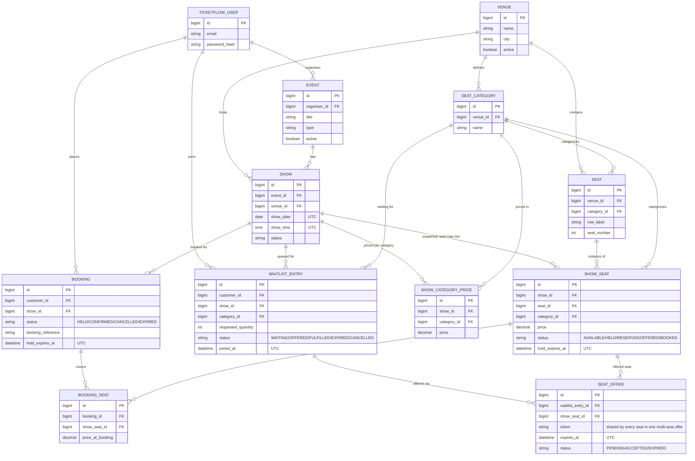

# TicketFlow

A ticket booking backend for movies and concerts: venues with visual seat maps, shows with
per-category pricing, seat holds with a configurable TTL, a waitlist with automatic seat
reassignment on cancellation, and QR-code ticket emails.

## Live

| | |
|---|---|
| **App** | https://ticketflow-ebon.vercel.app/ |
| **Frontend repo** | https://github.com/Vishwajitp18/TicketFlow_Website |
| **Backend API** (this repo) | https://ticketflow-api-r8oe.onrender.com/api/v1 |
| **System design write-up** | [`SYSTEM_DESIGN.md`](./SYSTEM_DESIGN.md) — concurrency, seat-hold TTL, waitlist auto-assignment |
| **Full API reference** | [`API_SPEC.md`](./API_SPEC.md) — every endpoint, request/response shapes, WebSocket contract |

The backend is a free-tier Render instance — the first request after a period of inactivity
can take 30-60s to wake up.

### Test admin account

ADMIN is seeded once on startup and isn't self-registerable (see [Roles](#roles)) — use this
account to log in as ADMIN and exercise venue creation:

```
email:    admin@ticketflow.com
password: admin@12345
```

`POST /auth/login` with these returns an ADMIN-scoped access token. CUSTOMER and ORGANISER
accounts can be created freely via `POST /auth/register`.

## Tech stack

Java 21, Spring Boot 3.5.7, Spring Security (JWT), Spring Data JPA, PostgreSQL, ShedLock
(distributed cron locking), Brevo (transactional email), Thymeleaf (email templates), ZXing
(QR code generation), plain STOMP over WebSocket, no SockJS (live seat map — see below).
**No Redis, no message broker** — see "Why no Redis/RabbitMQ?" below.

## Setup

### Prerequisites
- Java 21
- A PostgreSQL database (local or hosted)
- A free [Brevo](https://www.brevo.com) account + API key, for sending emails

### Run locally

```bash
# 1. copy the env template and fill in real values (at minimum BREVO_API_KEY)
cp .env.example .env

# 2. create the local database (defaults assume a local Postgres on 5432)
createdb ticketflow   # or: psql -c "CREATE DATABASE ticketflow;"

# 3. export the .env file into your shell, then run
export $(grep -v '^#' .env | xargs)
export SPRING_PROFILES_ACTIVE=local
./mvnw spring-boot:run
```

The app starts on `http://localhost:8080/api/v1`. On first startup it seeds one ADMIN account
from `ADMIN_EMAIL` / `ADMIN_PASSWORD` (skipped if an admin already exists) — admins are never
self-registered through the API.

### Run with Docker

```bash
docker build -t ticketflow .
docker run -p 8080:8080 --env-file .env -e SPRING_PROFILES_ACTIVE=prod ticketflow
```

### Deploy

`render.yaml` deploys the API as a Docker web service on [Render](https://render.com),
region `singapore`, against an **external Supabase Postgres** (not a Render-managed
database) — push the repo, New → Blueprint, connect it, and Render reads `render.yaml`
automatically. It'll prompt for every `sync: false` variable: `DATABASE_URL`/`DATABASE_USER`/
`DATABASE_PASSWORD` (Supabase's **session pooler**, port 5432 — not the transaction pooler on
6543, which breaks Hibernate's server-side prepared statements), `BREVO_API_KEY`,
`ADMIN_EMAIL`/`ADMIN_PASSWORD`, and the three `JWT_*` secrets (generate with `openssl rand
-hex 32` each). Everything else in `render.yaml` is a plain value already.

Render's free tier is memory-constrained (512MB) — the Dockerfile's `JAVA_OPTS` are sized for
that (container-aware `MaxRAMPercentage` instead of a hardcoded `-Xmx`, capped metaspace/code
cache, `SerialGC`); Swagger UI is also disabled in the `prod` profile since reflectively
scanning every controller at startup isn't worth the memory on that budget.

## Roles

- **CUSTOMER** — browses events, books seats, joins waitlists. Self-registers via `/auth/register`.
- **ORGANISER** — creates events/shows, sets pricing, views booking reports. Self-registers via `/auth/register`.
- **ADMIN** — creates and manages venues + seat layouts. Seeded once on startup (see above); not self-registerable.

## API reference

All routes are prefixed with `/api/v1`. Every response is wrapped as
`{ "timeStamp": ..., "data": ..., "error": ... }`.

### Auth — `/auth`
| Method | Path | Auth | Description |
|---|---|---|---|
| POST | `/auth/register` | none | Register as CUSTOMER or ORGANISER |
| POST | `/auth/login` | none | Returns access + refresh token |
| POST | `/auth/refresh` | header `x-refresh-token` | Rotates the refresh token, issues a new access token |
| POST | `/auth/logout` | Bearer + header `x-refresh-token` | Revokes the current session |

### Admin — `/admin/venues` (ADMIN)
| Method | Path | Description |
|---|---|---|
| POST | `/admin/venues` | Create a venue |
| GET | `/admin/venues` | List venues |
| GET | `/admin/venues/{venueId}` | Get a venue |
| POST | `/admin/venues/{venueId}/seats/bulk` | Add seat rows (`rowLabel`, `categoryName`, `seatCount`) — creates the venue's seat categories on the fly |
| GET | `/admin/venues/{venueId}/seats` | List the venue's static seat map |

### Organiser — `/organiser/events` (ORGANISER)
| Method | Path | Description |
|---|---|---|
| POST | `/organiser/events` | Create an event (`title`, `type`: MOVIE/CONCERT, `description`) |
| GET | `/organiser/events` | List my events (paged) |
| GET | `/organiser/events/{eventId}` | Get an event with **all** its shows, past and future — unlike the public detail view below |
| POST | `/organiser/events/{eventId}/shows` | Create a show (`venueId`, `showDate`, `showTime`, `categoryPrices`) — snapshots the venue's seat map into per-show seats, priced per category |
| GET | `/organiser/events/{eventId}/report` | Confirmed/cancelled booking counts + total revenue (owner-only) |

### Browse — `/events`, `/venues`, `/shows` (public)
Only **upcoming** shows are ever visible here — an event with every show already in the past
won't appear in search, and its detail view won't list those shows (compare the organiser's
own view above, which does see them, for management/reporting).

| Method | Path | Description |
|---|---|---|
| GET | `/events?type=&city=&q=&page=&size=` | Search/filter events with at least one upcoming show — `q` is fuzzy/typo-tolerant on title (Postgres trigram similarity) |
| GET | `/events/{eventId}` | Event detail with its **upcoming** shows and category pricing |
| GET | `/venues` | List venues (so an organiser/frontend can pick one for a new show) |
| GET | `/venues/{venueId}` | Get a venue |
| GET | `/venues/{venueId}/seats` | The venue's static seat layout (row/number/category) |
| GET | `/shows/{showId}/seatmap` | Per-seat status (`AVAILABLE`/`HELD`/`RESERVED`/`OFFERED`/`BOOKED`) — call **once** for the initial snapshot, then use the WebSocket feed below for live updates |

### Live seat map — WebSocket (no auth, public)
Plain STOMP over WebSocket (no SockJS — see `API_SPEC.md` §5 for why) at `wss://.../api/v1/ws`
(`ws://` locally). Subscribe to `/topic/shows/{showId}/seatmap` and apply each incoming
`{ "showSeatId": ..., "status": ... }` delta on top of the initial REST snapshot — this
**replaces polling** the seatmap endpoint above. Full client example, reconnection guidance,
and exact message shape in `API_SPEC.md` §5.

### Bookings — `/bookings` (CUSTOMER)
| Method | Path | Description |
|---|---|---|
| POST | `/bookings/hold` | Hold seats (`showId`, `showSeatIds[]`) — starts the TTL countdown. Rejects with `400` if the show has already happened |
| POST | `/bookings/{bookingId}/confirm` | Confirm with customer details — sends the QR ticket email |
| POST | `/bookings/{bookingId}/cancel` | Cancel a confirmed booking — frees the seat(s), triggers waitlist offers. Rejects with `400` once the show has already started |
| GET | `/bookings?page=&size=` | My booking history — only `CONFIRMED`/`CANCELLED`, no `HELD`/`EXPIRED` noise |
| GET | `/bookings/{bookingId}` | Booking detail (owner or the show's organiser) |

### Waitlist — `/waitlist` (CUSTOMER)
Quantity-based and all-or-nothing — see `SYSTEM_DESIGN.md`.

| Method | Path | Description |
|---|---|---|
| POST | `/waitlist` | Join the waitlist for a sold-out `showId` + `categoryId`, wanting `quantity` seats together. Rejects with `400` if the show has already happened |
| GET | `/waitlist?page=&size=` | My waitlist entries |
| POST | `/waitlist/offers/{token}/accept` | Accept a time-limited seat offer (the link from the offer email) — converts it into a normal held booking |

## Database schema (high level)



- `seat` is the venue's static seat map (row/number/category), created once per venue.
- `show_seat` is a per-show snapshot of that seat map (one row per seat per show) — this is
  where live status (`AVAILABLE`/`HELD`/`RESERVED`/`OFFERED`/`BOOKED` — `RESERVED` means
  pulled into a category's shared waitlist pool, not directly bookable), the current price,
  and the hold deadline live.
- `booking_seat` is a permanent historical link between a booking and the `show_seat`s it
  covered — it survives even after the seat is later freed and reused for someone else.
- `waitlist_entry` is a FIFO queue per `(show, category)`; `seat_offer` is the time-limited
  claim ticket handed to whichever entry is next in line.

## Timestamps and timezones — everything is UTC

**The backend only ever computes, stores, and returns UTC.** It doesn't infer a timezone
from the request, the server, or anything else — `TimeZone.setDefault(UTC)` is pinned at
JVM startup specifically so this holds regardless of which machine or region the app runs
on (see `SYSTEM_DESIGN.md`-adjacent commit history if curious why). **All timezone
conversion for display is a frontend concern.**

Two different Java types show up in the API, and they're serialized differently — this
matters for how you parse them:

| Field(s) | Type | Wire format | Example |
|---|---|---|---|
| `timeStamp` (every response envelope), `holdExpiresAt`, `joinedAt` | `LocalDateTime` | ISO-ish, **no `Z` / no offset** | `"2026-08-24T06:32:06.412869"` |
| `showDate` / `showTime` (on `Show`, request and response) | `LocalDate` / `LocalTime` | plain date / plain time, no zone concept at all | `"2026-09-01"` / `"19:00:00"` |

Because there's no `Z` suffix, a naive `new Date("2026-08-24T06:32:06.412869")` in JS will
be parsed as **local time**, not UTC — silently wrong by however many hours your viewer's
timezone is offset. You need to tell the parser it's UTC explicitly:

```js
// Reading a timestamp from the API (display)
import dayjs from 'dayjs';
import utc from 'dayjs/plugin/utc';
dayjs.extend(utc);

const local = dayjs.utc(apiResponse.data.holdExpiresAt).local();
// or, without a library:
const local2 = new Date(apiResponse.data.holdExpiresAt + 'Z'); // append Z before parsing
```

**The one place this runs the other way** — where the frontend *sends* a date/time
*to* the backend — is `POST /organiser/events/{eventId}/shows` (`showDate` + `showTime`,
when an organiser schedules a show). The backend's "is this show upcoming?" logic (powering
search/browse filtering and the hold/waitlist rejection of past shows) compares those two
fields against `LocalDate.now()`/`LocalTime.now()` — which, per the above, is UTC "now".
**So the organiser UI must convert whatever local date/time it collects into UTC before
sending it**, or a show scheduled for "7pm IST" would be stored and compared against as if
it meant "7pm UTC" — off by 5.5 hours, potentially flipping whether the show even counts as
upcoming.

```js
// Before sending showDate/showTime to POST /organiser/events/{eventId}/shows
const utcMoment = dayjs(localDateTimeFromForm).utc();
const showDate = utcMoment.format('YYYY-MM-DD');
const showTime = utcMoment.format('HH:mm:ss');
```

No other request body in this API currently accepts a date/time field — everything else
(`holdExpiresAt`, `joinedAt`, etc.) is server-computed and read-only from the frontend's
perspective.

## Seat hold TTL and waitlist logic

See `SYSTEM_DESIGN.md` for the full write-up. Short version:

- **Hold TTL**: selecting seats locks the specific `show_seat` rows
  (`SELECT ... FOR UPDATE`, ordered by id to avoid deadlocks), checks they're all
  `AVAILABLE`, and flips them to `HELD` with `holdExpiresAt = now + BOOKING_HOLD_TTL_MINUTES`.
  A ShedLock-guarded cron (`BookingServiceImpl.cleanUpExpiredHoldsAndOffers`, every 30s)
  scans for `HELD` bookings past that deadline and releases their seats.
- **Concurrency**: the `SELECT ... FOR UPDATE` lock *is* the concurrency guarantee — two
  simultaneous hold requests for the same seat serialize on that row lock, and the loser sees
  a non-`AVAILABLE` status once it acquires the lock, failing cleanly with a 409.
- **Waitlist auto-assignment**: waitlisting is quantity-based and all-or-nothing — you ask
  for N seats in a category together, never fewer. `SeatReleaseService.freeSeat` pulls a
  freed seat into a shared, anonymous per-category pool instead of `AVAILABLE` whenever that
  category has a queue; `tryFulfillQueue` then walks the queue in join order, bundling exactly
  N pooled seats into one offer the instant N are available, skipping over any entry the pool
  can't cover yet so a smaller request behind it isn't blocked. Called from cancellation,
  hold-expiry, *and* offer-expiry, so "waitlist gets auto-assigned on cancellation" and "an
  unclaimed offer cascades to the next in line" fall out of the same code path. Full math in
  `SYSTEM_DESIGN.md`.

## Requirements coverage

| Requirement | Status |
|---|---|
| Admin creates venues with seat layout + categories | ✅ `POST /admin/venues`, `POST /admin/venues/{id}/seats/bulk` |
| Organiser registers/logs in, creates events with venue/date/time/per-category pricing | ✅ `/auth/register`, `/organiser/events`, `/organiser/events/{id}/shows` |
| Customer registers/logs in, browses/filters events, views a live seat map | ✅ `/auth/register`, `GET /events` (with fuzzy `q`, `type`, `city`), `GET /shows/{id}/seatmap` + WebSocket push for live status |
| Seat hold with configurable TTL; held seats shown unavailable | ✅ `POST /bookings/hold`, `BOOKING_HOLD_TTL_MINUTES` |
| Auto-release on checkout abandonment; seat map updates | ✅ hold-expiry cron + WebSocket push |
| Concurrency: two customers can't hold/book the same seat | ✅ `SELECT ... FOR UPDATE`, id-ordered, see `SYSTEM_DESIGN.md` |
| Confirmed booking → email with QR encoding the booking reference | ✅ `POST /bookings/{id}/confirm`, CID-embedded QR (Brevo) |
| Waitlist per seat category when sold out | ✅ `POST /waitlist` — quantity-based (see below), not just single-seat |
| Cancellation → seat offered to next waitlisted customer with time-limited link | ✅ `SeatReleaseService` + offer email |
| Unclaimed offer → cascades to next in line | ✅ offer-expiry cron re-enters the same pool logic |
| Booking history + cancel | ✅ `GET /bookings` (confirmed/cancelled only), `POST /bookings/{id}/cancel` |
| Organiser booking summary + revenue per event | ✅ `GET /organiser/events/{id}/report` |
| Role-based auth (customer/organiser/admin) | ✅ JWT + Spring Security, see Roles above |

**Went beyond the spec:** waitlisting is quantity-based and all-or-nothing (join for N seats
together, never offered fewer) rather than one seat at a time — see `SYSTEM_DESIGN.md`.

**Deliberately out of scope:**
- **No payment step** — a booking confirms instantly on entering customer details; the spec
  never calls for payment integration.
- **No admin edit/deactivate for venues** — venues can be created and have seats added, but
  not edited or deactivated after the fact (the `active` flag exists in the schema for this,
  just isn't wired to an endpoint yet). A contained, known gap, not an oversight.
- **No frontend in this repository** — this is the backend API; `API_SPEC.md` is the contract
  the frontend ([live](https://ticketflow-ebon.vercel.app/), [repo](https://github.com/Vishwajitp18/TicketFlow_Website))
  is built against. Its seat-map UI uses the WebSocket feed above, not polling.
